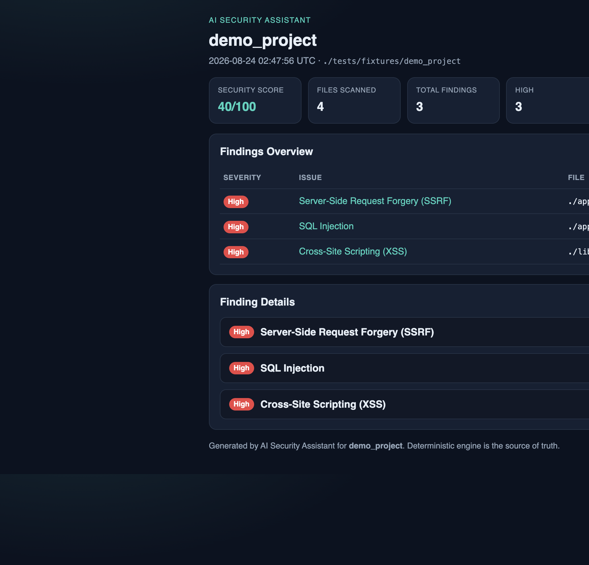

# AI Security Assistant

**Version 1.0.0** (release candidate documentation — not yet tagged/published)

Educational, **Python-focused**, **SAST-style** security assistant. A **deterministic, evidence-first** static analyzer is the source of truth. Optional AI explains findings and suggests fixes — it does **not** detect vulnerabilities or override the engine.

| | |
| --- | --- |
| **Status** | V1.0.0 release candidate |
| **License** | MIT |
| **Requires** | Python 3.12+ |
| **Interfaces** | CLI · VS Code / Cursor extension · HTML/Markdown reports |

---

## What this project is

- An **educational** security assistant for learning and reviewing common web AppSec issues in Python code
- **Deterministic static analysis** (AST + evidence flow) decides issue type and confidence
- **AI is optional**: explanations and fix suggestions only — never classification
- Designed for developers and students who want local scanning with a reviewable fix workflow

It is **not** a full commercial SAST product and is **not** a substitute for professional AppSec review.

---

## Supported vulnerability classes (V1)

| Class | Description |
| --- | --- |
| **SQL Injection** | User input reaching SQL sinks via unsafe string construction |
| **XSS** | Untrusted data reflected into HTML / unsafe markup sinks |
| **SSRF** | User-controlled URLs used in outbound HTTP / URL-open calls |
| **Unsafe File Upload** | Dangerous upload paths, names, or web-root writes |
| **IDOR / access control** | Object access keyed by attacker-controlled identity without ownership checks |

When signals are weak, the engine may report insufficient evidence rather than force a class.

---

## Interfaces

### CLI

Local command-line scanning, single-file analysis, project scan, optional AI fix suggestions, and HTML/Markdown reports.

### VS Code / Cursor extension

- **Problems** diagnostics on source lines
- **Sidebar** findings grouped by file
- **Finding detail** view (evidence, remediation, optional AI explanation)
- **Optional AI** explanations and fix suggestions
- **Review-before-apply** suggested fixes (diff + confirm)
- **Automatic rescan** after a fix is applied

The extension does **not** implement its own detector — it runs the local CLI and displays JSON findings.

---

## Architecture

```text
Parser / AST  →  Evidence  →  Adapter  →  Deterministic Engine  →  Optional AI
                                                      ↑
                                         source of truth (never overridden)
```

- The engine classifies and scores confidence from evidence
- AI may explain or propose a fix; invalid or missing AI leaves deterministic output unchanged
- VS Code and reports consume CLI JSON / report models only

---

## Evaluation

V1 reports two kinds of numbers. Do **not** treat them as interchangeable.

### Development / regression benchmark

A locked internal suite used during development to catch regressions. Strong scores here measure **stability on known fixtures**, not unbiased real-world accuracy.

### Blind holdout evaluation (public summary)

Two independent, previously unseen corpora were **locked before scanning**. Each set was scanned once at a frozen scanner checkpoint **before** any scanner changes based on those results. These are the public generalization measurements for V1.

**Holdout #3** (150 cases)

| Metric | Value |
| --- | ---: |
| Accuracy | 93.3% |
| Precision | 94.5% |
| Recall | 92.0% |
| F1 | 93.2% |
| False-positive rate | 5.3% |

**Holdout #4** (100 cases) — final blind measurement before the V1 product gate

| Metric | Value |
| --- | ---: |
| Accuracy | 93.0% |
| Precision | 93.9% |
| Recall | 92.0% |
| F1 | 92.9% |
| False-positive rate | 6.0% |

Tuned or re-run results on earlier holdouts are **not** claimed as blind validation.

Details and artifacts live under [`evaluation/`](evaluation/).

---

## Installation

### 1. Install the CLI

Requires **Python 3.12+** and [uv](https://docs.astral.sh/uv/) (recommended) or an editable `pip` install.

```sh
git clone https://github.com/mingkun-tang/ai-security-assistant.git
cd ai-security-assistant
uv sync
uv run ai-security-assistant --version
```

Confirm a scan works:

```sh
uv run ai-security-assistant scan tests/fixtures/demo_project
```

To put the CLI on your `PATH` for the current shell (after `uv sync`):

```sh
export PATH="$(pwd)/.venv/bin:$PATH"
ai-security-assistant --version
```

Alternatively: `pip install -e .` in a Python 3.12+ virtual environment, then run `ai-security-assistant`.

### 2. Install the VS Code / Cursor extension

From a release asset or a local package:

```sh
cd vscode-extension
npm install
npm run compile
npm run package   # produces ai-security-assistant-1.0.0.vsix
```

In VS Code or Cursor:

1. Command Palette → **Extensions: Install from VSIX…**
2. Select `ai-security-assistant-1.0.0.vsix`
3. Reload the window if prompted

Then open a Python project and run:

- **AI Security Assistant: Scan Workspace**
- **AI Security Assistant: Scan Current File**

Full extension docs: [`vscode-extension/README.md`](vscode-extension/README.md).

### Troubleshooting: `aiSecurityAssistant.executablePath`

The extension looks for an `ai-security-assistant` executable (default setting value: `ai-security-assistant`).

If automatic discovery fails (command not found, empty Problems after scan, or CLI errors in the output channel):

1. Locate your installed executable — commonly `.venv/bin/ai-security-assistant` after `uv sync` in this repo.
2. Set **AI Security Assistant: Executable Path** (`aiSecurityAssistant.executablePath`) to that **absolute** path, for example:

```json
{
  "aiSecurityAssistant.executablePath": "/absolute/path/to/.venv/bin/ai-security-assistant"
}
```

When this repository is the workspace root, you can also use:

```json
{
  "aiSecurityAssistant.executablePath": "${workspaceFolder}/.venv/bin/ai-security-assistant"
}
```

(`${workspaceFolder}` works in `.vscode/settings.json` when the repo root is open.)

---

## CLI usage

```sh
ai-security-assistant analyze                 # interactive scenario
ai-security-assistant analyze-file path.py    # single file
ai-security-assistant scan .                  # project scan
ai-security-assistant suggest-fix …          # optional AI fix (needs API key)
ai-security-assistant report . --html         # HTML report
ai-security-assistant report . --markdown     # Markdown report
```

Add `--json` where supported for machine-readable deterministic output.

---

## AI explanations and fixes

**AI is optional.** Deterministic scanning, VS Code findings, and reports work **without** an OpenAI API key.

When you enable AI:

- Provide your own key via `OPENAI_API_KEY` (see [`README_AI.md`](README_AI.md)). Usage is billed to your OpenAI account.
- **Default model:** `gpt-4o-mini`. Override with `OPENAI_MODEL`, or in VS Code via `aiSecurityAssistant.openaiModel` (environment wins if already set).
- Explanations clarify **why** a finding matters — they do **not** change issue type or confidence.
- Fix suggestions are **proposals**. The extension shows a diff and asks before applying; after apply, it **rescans** automatically.
- Without a key, AI panels show an unavailable state; scanning still works.

### Privacy and data handling

Finding metadata and relevant **source snippets** used for AI explanations or fix suggestions may be **transmitted to the configured AI provider** (for example OpenAI). Review your organization’s data-handling and compliance requirements before enabling AI. Prefer leaving `OPENAI_API_KEY` unset when working on sensitive codebases.

AI requests are intentionally small (finding fields + matched snippet) — not your entire repository — but they still leave your machine.

---

## Security reports

```sh
ai-security-assistant report . --html --no-ai-summary -o security-report.html
ai-security-assistant report . --markdown --no-ai-summary -o security-report.md
```

Reports lead with **summary + findings table**; HTML details are collapsed (`<details>`); Markdown stays short.

Sample output: [`examples/security-report.html`](examples/security-report.html), [`examples/security-report.md`](examples/security-report.md).

---

## Screenshots

| Surface | Status |
| --- | --- |
| HTML report |  |
| VS Code findings / Problems | *Placeholder* — `docs/screenshots/vscode-findings.png` |
| Finding detail view | *Placeholder* — `docs/screenshots/finding-detail.png` |
| AI fix suggestion | *Placeholder* — `docs/screenshots/ai-fix-suggestion.png` |
| CLI scan | *Placeholder* — `docs/screenshots/cli-scan.png` |

Drop real PNGs into `docs/screenshots/` when available. Do not invent UI screenshots.

---

## Limitations (V1)

Please read these before relying on scan results:

- **Lightweight static analysis** — not full commercial SAST depth
- **Python-focused** current scope (CLI also supports scenario mode)
- **Primarily local / single-function** analysis — not full whole-program or arbitrary cross-module interprocedural analysis
- **Unusual SQL construction**, aliases, or multi-hop query building can be **missed**
- **Templating / static Markup** patterns can produce **XSS false positives**
- **Nonstandard / business-key** identity fields can cause **IDOR misses**
- Occasional **cross-class false-positive noise**
- **Guard recognition** is **pattern-based**, not full control-flow dominance analysis
- Results should be **reviewed by a developer or security engineer**
- **Not a replacement** for mature SAST tooling, code review, penetration testing, or professional AppSec review
- AI suggestion quality depends on the provider; always review before apply
- Extension Marketplace / PyPI publish are optional follow-ups (`.vsix` sideload works today)

---

## Roadmap

- Marketplace + PyPI publish
- Real README screenshots from product UI
- Optional GitHub Action for `scan` / `report`
- Broader language support (post-v1)
- Engine hardening only with explicit review (detection changes are frozen for this V1 checkpoint)

---

## Development setup

```sh
uv sync
uv run pytest
cd vscode-extension && npm install && npm test && npm run package
```

Release steps: [`docs/RELEASE_CHECKLIST.md`](docs/RELEASE_CHECKLIST.md).  
Changes: [`CHANGELOG.md`](CHANGELOG.md).  
Optional AI setup: [`README_AI.md`](README_AI.md).

---

## License

[MIT](LICENSE)
