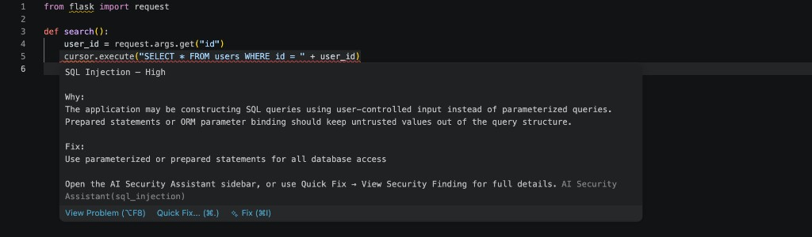
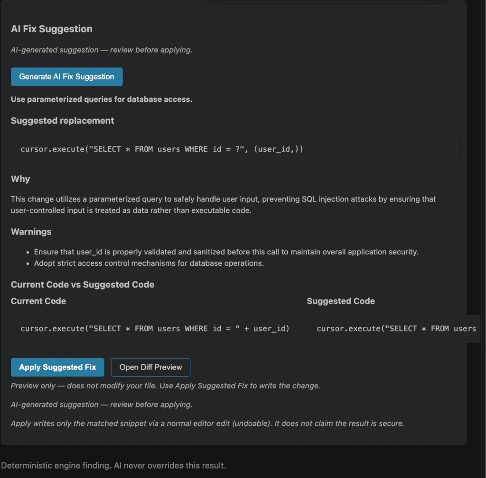
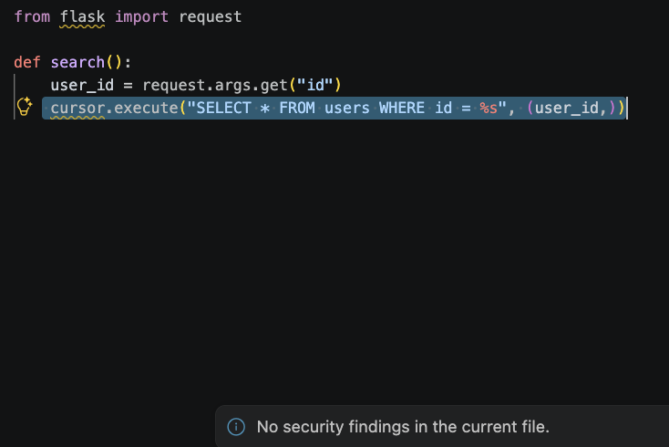

# AI Security Assistant

AI Security Assistant is an open-source static analysis tool and VS Code extension for finding common security vulnerabilities in Python code.

The vulnerability scanner is built from scratch and runs locally. It uses deterministic static analysis to track sources, sinks, data flow, and security guards. It currently detects SQL injection, XSS, SSRF, unsafe file uploads, and IDOR patterns.

AI is optional and is not used to detect vulnerabilities. Once the scanner finds an issue, an AI layer can explain the finding and suggest a possible fix. The scanner works without an API key.

## Why I built it

I built this project to better understand how application security tools reason about vulnerable code instead of simply sending source code to an LLM and asking whether it looks vulnerable.

The project started as a small rule-based security analyzer and grew into a static analysis engine with a VS Code extension, evaluation suite, and optional AI-assisted remediation.

## Supported vulnerability classes (V1)

| Class | Description |
| --- | --- |
| **SQL Injection** | User input reaching SQL sinks via unsafe string construction |
| **XSS** | Untrusted data reflected into HTML / unsafe markup sinks |
| **SSRF** | User-controlled URLs used in outbound HTTP / URL-open calls |
| **Unsafe File Upload** | Dangerous upload paths, names, or web-root writes |
| **IDOR / access control** | Object access keyed by attacker-controlled identity without ownership checks |

If the scanner does not have enough evidence, it avoids forcing a vulnerability classification.

---

## Interfaces

### CLI

Local command-line scanning, single-file analysis, project scan, optional AI fix suggestions, and HTML/Markdown reports.

### VS Code / Cursor extension

- **Problems** diagnostics on source lines
- **Sidebar** findings grouped by file
- **Finding detail** view (evidence, remediation, optional AI explanation)
- **Optional AI** explanations and fix suggestions
- **Review-before-apply** suggested fixes (diff + confirm)
- **Automatic rescan** after a fix is applied

The extension does **not** implement its own detector — it runs the local CLI and displays JSON findings.

---

## Architecture

```text
Python Source Code
       ↓
   Parser / AST
       ↓
 Evidence + Data Flow
       ↓
Deterministic Scanner
       ↓
 Security Finding
       ↓
 Optional AI
 (explanation / fix suggestion)
```

- Vulnerabilities are detected by the static analysis engine, not by AI.
- The AI layer only explains existing findings and suggests possible fixes.
- Removing the AI layer does not affect vulnerability detection.
- The VS Code extension uses the same deterministic scanner as the CLI.

---

## Evaluation

I tested the scanner in two different ways: with a development regression suite and with separate blind holdout sets.

### Development benchmark

The development suite is used to catch regressions while changing the scanner. Because these cases are visible during development, I do not use its results as a measure of real-world or blind performance.

### Blind holdout results

For a more realistic test, I evaluated the scanner on two separate holdout sets that were not used while developing or tuning the scanner.

**Holdout #3** (150 cases)

| Metric | Value |
| --- | ---: |
| Accuracy | 93.3% |
| Precision | 94.5% |
| Recall | 92.0% |
| F1 | 93.2% |
| False-positive rate | 5.3% |

**Holdout #4** (100 cases)

| Metric | Value |
| --- | ---: |
| Accuracy | 93.0% |
| Precision | 93.9% |
| Recall | 92.0% |
| F1 | 92.9% |
| False-positive rate | 6.0% |

Across these two blind holdouts, the scanner achieved about **93% accuracy and 0.93 F1**.

These results are specific to the benchmark cases and vulnerability classes tested here. They should not be interpreted as a claim that the scanner will achieve the same accuracy on arbitrary real-world codebases.

Earlier holdouts that were later used for tuning are not included as blind validation results.

The benchmark cases and evaluation artifacts are available under [`evaluation/`](evaluation/).

---

## Installation

### 1. Install the CLI

You need **Python 3.12+**. [uv](https://docs.astral.sh/uv/) is recommended; an editable `pip` install also works.

```sh
git clone https://github.com/mingkun-tang/ai-security-assistant.git
cd ai-security-assistant
uv sync
uv run ai-security-assistant --version
```

Confirm a scan works:

```sh
uv run ai-security-assistant scan tests/fixtures/demo_project
```

To put the CLI on your `PATH` for the current shell (after `uv sync`):

```sh
export PATH="$(pwd)/.venv/bin:$PATH"
ai-security-assistant --version
```

Alternatively: `pip install -e .` in a Python 3.12+ virtual environment, then run `ai-security-assistant`.

### 2. Install the VS Code / Cursor extension

Build a local VSIX (sideload install — not Marketplace yet):

```sh
cd vscode-extension
npm install
npm run compile
npm run package   # produces ai-security-assistant-1.0.0.vsix
```

In VS Code or Cursor:

1. Command Palette → **Extensions: Install from VSIX…**
2. Select `ai-security-assistant-1.0.0.vsix`
3. Reload the window if prompted

Open a Python project and run:

- **AI Security Assistant: Scan Workspace**
- **AI Security Assistant: Scan Current File**

More detail: [`vscode-extension/README.md`](vscode-extension/README.md).

### Troubleshooting (only if the CLI is not found)

Most installs work without changing settings. The extension looks for an `ai-security-assistant` executable (default: `ai-security-assistant`).

If discovery fails — command not found, empty Problems after scan, or CLI errors in the output channel:

1. Find your installed executable (commonly `.venv/bin/ai-security-assistant` after `uv sync` in this repo).
2. Set **AI Security Assistant: Executable Path** (`aiSecurityAssistant.executablePath`) to that absolute path, for example:

```json
{
  "aiSecurityAssistant.executablePath": "/absolute/path/to/.venv/bin/ai-security-assistant"
}
```

When this repository is the workspace root, you can also use:

```json
{
  "aiSecurityAssistant.executablePath": "${workspaceFolder}/.venv/bin/ai-security-assistant"
}
```

(`${workspaceFolder}` works in `.vscode/settings.json` when the repo root is open.)

---

## CLI usage

```sh
ai-security-assistant analyze                 # interactive scenario
ai-security-assistant analyze-file path.py    # single file
ai-security-assistant scan .                  # project scan
ai-security-assistant suggest-fix …          # optional AI fix (needs API key)
ai-security-assistant report . --html         # HTML report
ai-security-assistant report . --markdown     # Markdown report
```

Add `--json` where supported for machine-readable deterministic output.

---

## AI explanations and fixes

AI is an optional layer on top of the scanner. It does **not** detect vulnerabilities.

The static analysis engine finds and classifies the security issue first. AI can then use that existing finding to:

- explain why the issue matters
- suggest a possible code fix
- show the suggested change for review before it is applied

AI cannot create, remove, or override scanner findings. If no API key is configured, scanning, VS Code findings, and security reports still work normally.

To enable AI features:

- Set your own `OPENAI_API_KEY` (see [`README_AI.md`](README_AI.md)).
- The default model is `gpt-4o-mini`.
- You can change the model with `OPENAI_MODEL` or through the VS Code extension settings.
- Fix suggestions should be reviewed before applying them.

### Privacy and data handling

AI features send finding metadata and the relevant source-code snippet to the configured AI provider. The entire repository is not sent.

If you do not enable AI features, source code is analyzed locally by the deterministic scanner.

---

## Security reports

```sh
ai-security-assistant report . --html --no-ai-summary -o security-report.html
ai-security-assistant report . --markdown --no-ai-summary -o security-report.md
```

Reports lead with **summary + findings table**; HTML details are collapsed (`<details>`); Markdown stays short.

Sample output: [`examples/security-report.html`](examples/security-report.html), [`examples/security-report.md`](examples/security-report.md).

---

## Screenshots

### Vulnerability detection

The scanner flags an unsafe SQL query directly in the editor and explains why it was detected.



### Optional AI fix suggestion

After the scanner has already identified the vulnerability, the optional AI layer can suggest a fix and show the current code next to the proposed replacement.



### Fix applied and rescanned

After applying the suggested change, the file is rescanned and the SQL injection finding is no longer detected.



### HTML report


---

## Limitations (V1)

V1 is a lightweight Python static analyzer, not a replacement for a full commercial SAST platform or manual security review.

Known limitations:

- Analysis is mainly local to individual functions rather than full whole-program or cross-module analysis.
- Unusual SQL construction, aliases, and multi-step query building can sometimes be missed.
- Some templating and static markup patterns can produce XSS false positives.
- IDOR detection may miss applications that use nonstandard business keys or identity fields.
- Some patterns can produce findings from the wrong vulnerability class.
- Security guard recognition is pattern-based and does not perform full control-flow analysis.
- AI fix suggestions can vary by model and should always be reviewed before applying.

Scanner findings should be treated as security signals to investigate, not proof that code is definitely vulnerable or secure.

For production applications, use this tool alongside code review, testing, and established security tooling.

---

## Roadmap

Possible next steps after V1:

- Publish the VS Code extension to the Marketplace.
- Make CLI installation easier, including a possible PyPI release.
- Add GitHub Actions support for automated security scans.
- Improve cross-function and cross-module analysis.
- Expand detection coverage while keeping the scanner deterministic.
- Explore support for additional programming languages.

The current V1 scanner will remain usable without AI. Future AI features will continue to be optional and separate from vulnerability detection.

---

## Development setup

```sh
uv sync
uv run pytest
cd vscode-extension && npm install && npm test && npm run package
```

Release steps: [`docs/RELEASE_CHECKLIST.md`](docs/RELEASE_CHECKLIST.md).  
Changes: [`CHANGELOG.md`](CHANGELOG.md).  
Optional AI setup: [`README_AI.md`](README_AI.md).

---

## License

[MIT](LICENSE)
